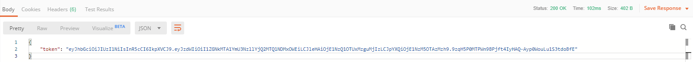

# Projet - TripAdvisor

## 1. Introduction

Ce projet a été réalisé dans le cadre de la HEIG-VD, en 3ème année d’ingénierie des médias. Le but de ce projet est de réaliser une API REST. Pour cela, nous avons repris le projet “TripAdvisor” permettant d’afficher des lieux, des commentaires et de permettre aux utilisateur d'ajouter des commentaires.

## 2. Pré-requis
- [Node.js version 12.x](https://nodejs.org/en/download/)
- [MongoDB version 4.x](https://www.mongodb.com/download-center/community)
- [Git for Windows](https://gitforwindows.org/)
- [Postman](https://www.getpostman.com/)

## 3. Projet
### 3.1 Installation

Avant de commencer, voici une marche à suivre pour installer le projet en local. Dans un premier temps, faîtes un *git clone* du repo dans le dossier que vous souhaitez :
```bash
git clone https://github.com/MalorieGenoud/Projet_TripAdvisor
```

Ensuite, allez dans votre dossier cloné et ouvrez *git bash*. Assurez-vous d'être dans le bon dossier pour effectuer les commandes. Par exemple
```bash
/c/Projet_TripAdvisor/
```
Une fois que cela est fait, tapez les commandes suivantes :
```bash
npm i
```
```bash
npm i --save mongodb
```
```bash
npm i --save mongoose
```

### 3.2 Démarrer le Projet

Dans un premier temps, ouvrez votre invite de commande et copier/coller la ligne suivante :
```bash
"C:\Program Files\MongoDB\Server\4.2\bin\mongod.exe"
```

Ceci va permettre d'exécuter **MongoDB** et ainsi de pouvoir travailler avec la base de données.

Ensuite allez dans votre dossier contenant le clone du repo git et exécutez **git bash**. Exécutez la ligne suivante :
```bash
DEBUG=Projet_TripAdvisor:* nodemon
```

Ceci va permettre d'exécuter le code en mode développeur et donc de prendre en compte les changements qui sont faits.

Il est possible que certains packages ne soient pas installés, pour cela il vous suffit d'excécuter la ligne suivante :
```bash
npm i --save nomDuPackage
```

### 3.3 Architecture

Voic un schéma représentant l'architecture du dossier (on ne représente que les dossiers importants).


- Le dossier **functions** contient le fichier de nos différentes fonctions et middlewares.
  - Nom du fichier : *functions.js*
- Le dossier **models** contient les fichiers des schémas de la base de données.
  - Nom des fichiers : *users.js*, *places.js* et *comments.js*
- Le dossier **routes** contient les fichiers de nos routes
  - Nom des fichiers : *users.js* et *places.js*
  - Le fichier *index.js* n'est pas utilisé
- Le dossier **spec** contiens les fichiers de tests automatisés
  - Nom des fichiers : *places.spec.js*, *users.spec.js* et *utils.js*
- Le dossier **websocket** contient notre dispatcher
  - Nom du fichier : *dispatcher.js*

### 3.4 Base de données

#### 3.4.1 Schéma

Voici un schéma représentant notre base de données.


Pour chacune des tables, voici les champs :
1. User
  - username
  - password
  - registrationDate
2. Place
  - description
  - geolocation
  - picture
  - creationDate
  - lastModifDate
3. Comment
  - rating
  - description
  - picture
  - creationDate
  - lastModifDate

#### 3.4.2 Code (schéma)

##### 3.4.2.1 Users

Voici la représentation de notre schéma en code. Pour le champ *username*, nous avons créé une fonction de validation. Ainsi, il n'est pas possible pour un utilisateur d'avoir le même "username" qu'un autre déjà existant. Dans le cas où cela se produit, un message d'erreur s'affichera.

```javascript
const userSchema = new mongoose.Schema({
    username: {
        type: String,
        required: true,
        minlength: 3,
        maxlength: 15,
        unique: true,
        validate:
        // Create a validation if the username already exists
        [{
            validator: validateUsernameUniqueness,
            message:'Username {VALUE} already exists'
        }],
    },
    password: {
        type: String,
        required: true,
        minlength: 6,
        maxlength: 255,
    },
    registrationDate: {
        type: Date,
        required: true,
        default: Date.now
    }
});
```
##### 3.4.2.2 Places

Voici la représentation de notre schéma en code. Pour le champ *geolocation* plus précisemment *coordinates*, nous avons créé une fonction de validation. Ainsi, si les coordonnées transmises ne sont pas correctes, un message d'erreur s'affichera

```javascript
const placeSchema = new mongoose.Schema({
    description: {
        type: String,
        required: true,
        minlength: 10,
        maxlength: 150,
    },
    geolocation: {
        type: {
                type: String,
                required: true,
                enum: [ 'Point' ]
            },
        coordinates: {
            type: [ Number ],
            required: true,
            // Allows to validate the format we pass to it
            validate: {
                validator: validateGeoJsonCoordinates,
                message: '{VALUE} is not a valid longitude/latitude(/altitude) coordinates array'
            }
        }
    },
    picture: {
        type: String,
        required: true
    },
    creationDate: {
        type: Date,
        required: true,
        default: Date.now
    },
    lastModifDate: {
        type: Date,
        required: true,
        default: Date.now
    }
});
```

##### 3.4.2.3 Comments

Voici la représentation de notre schéma en code. Nous avons ajouté deux clés étrangères à la table : *placeId* et *userId*.

```javascript
const commentSchema = new mongoose.Schema({
    rating: {
        type: Number,
        min: 0,
        max: 10
    },
    description: {
        type: String,
        required: true,
        minlength: 10,
        maxlength: 150,
    },
    picture: {
        type: String,
        required: false
    },
    creationDate: {
        type: Date,
        required: true,
        default: Date.now
    },
    lastModifDate: {
        type: Date,
        required: true,
        default: Date.now
    },
    // Foreign keys
    placeId: {
        type: Schema.Types.ObjectId,
        ref: 'Place',
        default: null,
        required: false
    },
    userId: {
        type: Schema.Types.ObjectId,
        ref: 'User',
        default: null,
        required: false
    }
});
```

#### 3.4.3 Routes

##### 3.4.3.1 Users

1. GET
  - Cette route permet d'afficher tous les utilisateurs présents dans la base de coordonnées
  - Code :
  ```javascript
  router.get('/users', function(req, res, next) {
      User.find().exec(function(err, users) {
          if (err) {
              return next(err);
          }

          //  Websocket
          const nbUsers = users.length;
          webSocket.nbUsers(nbUsers);

          res.send(users);
      });
  });
  ```
  - Exemple d'utilisation dans Postman : GET - http://localhost:3000/users
2. POST - Créer un utilisateur
  - Cette route permet de créer un utilisateur en cryptant son mot de passe
  - Code :
  ```javascript
  router.post('/users', function(req, res, next) {
      const plainPassword = req.body.password;
      const saltRounds = 10;
      bcrypt.hash(plainPassword, saltRounds, function(err, hashedPassword) {
          if (err) {
              return next(err);
          }
          const newUser = new User(req.body);
          newUser.password = hashedPassword;
          newUser.save(function(err, savedUser) {
              if (err) {
                  return next(err);
              }
              res.send(savedUser);
          });
      });
    });
  ```
  - Exemple du body dans Postman
  ```json
  {
      "username": "toto",
      "password": "123456"
  }
  ```
  - Exemple d'utilisation dans Postman : POST - http://localhost:3000/users
3. POST - S'authentifier **ATTENTION ! Vous devez avoir créé l'utilisateur avant cette étape**
  - Cette route permet de s'authentifier en récupérant le token et en l'ajoutant dans Postman
  - Code :
  ```javascript
  router.post('/users/login', function(req, res, next) {
      User.findOne({ username: req.body.username }).exec(function(err, user) {
          if (err) {
              return next(err);
          } else if (!user) {
              return res.sendStatus(401);
          }
          bcrypt.compare(req.body.password, user.password, function(err, valid) {
              if (err) {
                  return next(err);
              } else if (!valid) {
                  return res.sendStatus(401);
              }
          });

          // Generate a valid JWT which expires in 7 days.
          const exp = (new Date().getTime() + 7 * 24 * 3600 * 1000) / 1000;
          const claims = { sub: user._id.toString(), exp: exp };
          jwt.sign(claims, config.secretKey, function(err, token) {
              if (err) { return next(err); }
              res.send({ token: token }); // Send the token to the client.
          });
      })
  });
  ```
  - Exemple de body dans Postman
  ```json
  {
      "username": "toto",
      "password": "123456"
  }
  ```
  - Exemple d'utilisation dans Postman : POST - http://localhost:3000/users/login
  - Voici comment ajouter le token dans Postman
    - Conserver votre body tel qu'il est lorsque vous avez créé votre utilisateur (voir exemple plus haut). Lorsque vous envoyez la route dans Postman, le résultat du **Body** affichera le token
     
    - Copier ce token (sans les **" "**) et aller dans l'onglet **Authorization**, sélectionnez **Bearer token** dans la liste déroulante et coller-le dans le champ
     
4. DELETE
  - Cette route permet de supprimer un utilisateur spécifique ainsi que tous ses commentaires. Cette route est utilisable seulement si vous êtes authentifié.
  - Code :
  ```javascript
  router.delete('/users/:id', func.authenticate, function(req, res, next) {
      User.findByIdAndRemove(req.params.id, req.body, function (err, post) {
          if (err) {
              return next(err);
          }
          Comment.deleteMany().where('userId').equals(req.params.id).exec(function (err, comments) {
              if (err) {
                  return next(err);
              }
              res.sendStatus(204);
          });
      });
  });
  ```
  - Exemple d'utilisation dans Postman : DELETE - http://localhost:3000/users/1
    - Si vous ne connaissez pas l'**id** de votre utilisateur, faîtes un **GET** pour afficher tous les utilisateurs et retrouvez l'**id**

##### 3.4.3.2 Places

1. GET - Afficher toutes les lieux
  - Cette route permet d'afficher tous les lieux ainsi que le nombre de commentaires pour chaque lieux. Un système de pagination a été implémenté
  - Code :
  ```javascript
  router.get('/places', function (req, res, next) {
      Place.find().count(function (err, total) {
          if (err) {
              return next(err);
          }

          // Parse pagination parameters from URL query parameters
          const { page, pageSize } = func.getPaginationParameters(req);

          // Aggregation
          Place.aggregate([
              {
                  $lookup: {
                      from: 'comments',
                      localField: '_id',
                      foreignField: 'placeId',
                      as: 'commentedPlace'
                  }
              },
              {
                  $unwind:
                      {
                          path: "$commentedPlace",
                          preserveNullAndEmptyArrays: true
                      }
              },
              {
                  $set: {
                      commentedPlace: {
                          $cond: {
                              if: '$commentedPlace',
                              then: 1,
                              else: 0
                          }
                      }
                  }
              },
              {
                  $group: {
                      _id: '$_id',
                      description: { $first: '$description' },
                      picture: { $first: '$picture' },
                      createdAt: { $first: '$createdAt' },
                      geolocation: { $first: '$geolocation' },
                      lastModifDate: { $first: '$lastModifDate' },
                      commentedPlace: { $sum: '$commentedPlace' }
                  }
              },
              {
                  $sort: {
                      description: 1
                  }
              },
              {
                  $skip: (page - 1) * pageSize
              },
              {
                  $limit: pageSize
              }
          ], (err, places) => {
              if (err) {
                  return next(err);
              }
              console.log(places);

              // Add the Link header to the response
              func.addLinkHeader('/places', page, pageSize, total, res);

              // Websocket
              const nbPlaces = places.length;
              webSocket.nbPlaces(nbPlaces);

              res.send(places.map(place => {

                  // Transform the aggregated object into a Mongoose model.
                  const serialized = new Place(place).toJSON();

                  // Add the aggregated property.
                  serialized.commentedPlace = place.commentedPlace;

                  return serialized;
              }));
          });
      });
  });
  ```
  - Exemple d'utilisation dans Postman : GET - http://localhost:3000/places
  - Exemple d'utilisation pour la pagination : GET - http://localhost:3000/places?pageSize=2
2. GET Afficher un lieu spécifique
  - Cette route permet d'afficher un lieu spécifique
  - Code :
  ```javascript
  router.get('/places/:id', func.loadPlaceFromParamsMiddleware, function (req, res, next) {
      res.send(req.place);
  });
  ```
  - Exemple d'utilisation dans Postman : GET - http://localhost:3000/places/1
    - Si vous ne connaissez pas l'id de votre lieu, faîtes un GET pour afficher tous les lieux et retrouvez l'id
3. GET - Afficher tous les commentaires pour un lieu spécifique
  - Cette route permet d'afficher tous les commentaires pour un lieu spécifique. De plus, il est possible de faire un filtre en fonction de la note.
  - Code :
  ```javascript
  router.get('/places/:id/comments', function (req, res, next) {
      // Count total comment matching the URL query parameters
      const countQuery = func.queryComments(req);
      countQuery.count(function (err, total) {
          if (err) {
              return next(err);
          }

          // Prepare the initial database query from the URL query parameters
          let query = func.queryComments(req);

          query.exec(function (err, comments) {
              if (err) {
                  return next(err);
              }

              // Websocket
              const nbComments = comments.length;
              webSocket.nbComments(nbComments);

              res.send(comments);
          });
      });
  });
  ```
  - Exemple d'utilisation dans Postman : GET - http://localhost:3000/places/1/comments
  - Exemples de filtres dans Postman :
    - GET - http://localhost:3000/places/1/comments?rating=1
    - GET - http://localhost:3000/places/1/comments?ratedAtLeast=5
    - GEt - http://localhost:3000/places/1/comments?ratedAtMost=6
4. POST - Créer un lieu **ATTENTION ! Vous devez avoir créé l'utilisateur avant cette étape**
  - Cette route permet de créer un lieu
  - Code :
  ```javascript
  router.post('/places', func.authenticate, function (req, res, next) {
      new Place(req.body).save(function (err, savedPlace) {
          if (err) {
              return next(err);
          }

          res
              .status(201)
              .set('Location', `${config.baseUrl}/places/${savedPlace._id}`)
              .send(savedPlace);
      });
  });
  ```
  - Exemple de body dans Postman
  ```json
  {
      "description": "First place created",
      "geolocation":
      {
          "type": "Point",
          "coordinates": [ -73.856077, 40.848447 ]
      },
      "picture": "https://webassets.mongodb.com/_com_assets/cms/MongoDB_Logo_FullColorBlack_RGB-4td3yuxzjs.png"
  }
  ```  
  - Exemple d'utilisation dans Postman : POST - http://localhost:3000/places
5. POST - Créer un commentaire pour un lieu spécifique **ATTENTION ! Vous devez avoir créé l'utilisateur avant cette étape**
  - Cette route permet de créer un commentaitre pour un lieu spécifique. Afin de s'assurer de récuper le bon **id** du lieu, nous devons le récupérer dans le paramètre de l'URL que nous lui passons (ici **:id**)
  - Code :
  ```javascript
  router.post('/places/:id/comments', func.authenticate, function (req, res, next) {
      // Recover the place's id
      const comment = req.body;
      comment.placeId = req.params.id;

      new Comment(comment).save(function (err, savedComment) {
          if (err) {
              return next(err);
          }

          res
              .status(201)
              .set('Location', `${config.baseUrl}/places/:id/${savedComment._id}`)
              .send(savedComment);
      });
  });
  ```
  - Exemple de body dans Postman
  ```json
  {
      "rating": "10",
      "description": "First comment for this place",
      "placeId": "1",
      "userId": "1"
  }
  ```
    - Si vous ne connaissez pas l'id de votre utilisateur ainsi que du lieu, faîtes un GET pour chaucune des données et retrouvez l'id
  - Exemple d'utilisation dans Postman : POST - http://localhost:3000/places/1/comments
    - Si vous ne connaissez pas l'id de votre lieu, faîtes un GET pour afficher tous les lieux et retrouvez l'id
6. PUT - MàJ d'un lieu **ATTENTION ! Vous devez avoir créé l'utilisateur avant cette étape**
  - Cette route permet de mettre à jour les données d'un lieu spécifique
  - Code :
  ```javascript
  router.put('/places/:id', func.authenticate, func.requireJson, func.loadPlaceFromParamsMiddleware,
                function (req, res, next) {
      // Update all properties
      req.place.type = req.body.type;
      req.place.geolocation = req.body.geolocation;
      req.place.description = req.body.description;
      req.place.picture = req.body.picture;
      req.place.lastModifDate = Date.now();

      req.place.save(function (err, savedPlace) {
          if (err) {
              return next(err);
          }
          res.send(savedPlace);
      });
  });
  ```
  - Exemple de body dans Postman :
  ```json
  {
       "description": "First place created",
       "geolocation":
       {
           "type": "Point",
           "coordinates": [ -73.856077, 40.848447 ]
       },
       "picture": "https://webassets.mongodb.com/_com_assets/cms/MongoDB_Logo_FullColorBlack_RGB-4td3yuxzjs.png"
  }
  ```
  - Exemple d'utilisation dans Postman : PUT - http://localhost:3000/places/1
    - Si vous ne connaissez pas l'id de votre lieu, faîtes un GET pour afficher tous les lieux et retrouvez l'id
7. PUT - MàJ d'un comentaire spécifique à un lieu spécifique **ATTENTION ! Vous devez avoir créé l'utilisateur avant cette étape**
  - Cette route permet de mettre à jour un commentaire spécifique à un lieux- Code :
  ```javascript
  router.put('/places/:idPlace/comments/:id', func.authenticate, func.requireJson,
                func.loadCommentFromParamsMiddleware, function (req, res, next) {
      // Update all properties
      req.comment.description = req.body.description;
      req.comment.picture = req.body.picture;
      req.comment.lastModifDate = Date.now();

      req.comment.save(function (err, savedComment) {
          if (err) {
              return next(err);
          }
          res.send(savedComment);
      });
  });
  ```
  - Exemple de body dans Postman :
  ```json
  {
      "rating": "10",
      "description": "First comment for this place updated",
      "placeId": "1",
      "userId": "1"
  }
  ```
  - Exemple d'utilisation sur Postman : PUT - http://localhost:3000/places/1/comments/1
      - Si vous ne connaissez pas l'id du commentaire ainsi que du lieu, faîtes un GET pour chaucune des données et retrouvez l'id
8. DELETE - Supprimer un lieu spécifique **ATTENTION ! Vous devez avoir créé l'utilisateur avant cette étape**
  - Cette route permet de supprimer un lieu spécifique ainsi que tous les commentaires qui y sont rattachés
  - Code :
  ```javascript
  router.delete('/places/:id', func.authenticate, function (req, res, next) {
      Place.findByIdAndRemove(req.params.id, req.body, function (err, post) {
          if (err) {
              return next(err);
          }
          Comment.deleteMany().where('placeId').equals(req.params.id).exec(function (err, comments) {
              if (err) {
                  return next(err);
              }
              res.sendStatus(204);
          });
      });
  });
  ```
  - Exemple d'utilisation dans Postman : DELETE - http://localhost:3000/places/1
    - Si vous ne connaissez pas l'id de votre lieu, faîtes un GET pour afficher tous les lieux et retrouvez l'id
9. DELETE - Supprimer un commentaire spécifique à un lieu spécifique **ATTENTION ! Vous devez avoir créé l'utilisateur avant cette étape**
  - Cette route permet de supprimer un commentaire spécifique à un lieu spécifique
  - Code :
  ```javascript
  router.delete('/places/:idPlace/comments/:id', func.authenticate, function (req, res, next) {
      Comment.findByIdAndRemove(req.params.id, req.body, function (err, post) {
          if (err) {
              return next(err);
          }
          res.sendStatus(204);
      });
  });
  ```
  - Exemple d'utulisation dans Postman : DELETE - http://localhost:3000/places/1/comments/1
    - Si vous ne connaissez pas l'id du commentaire ainsi que du lieu, faîtes un GET pour chaucune des données et retrouvez l'id

#### 3.4.4 Fonctions et middlewares

##### 3.4.4.1 Authentification

Cette fonction permet de gérer l'authentification. Ainsi, lorsqu'elle est utilisée avec une "route", il n'est pas possible de l'effectuer si le token de l'utilisateur n'a pas été enregistré.
Il y a différents messages d'erreurs :
  - Quand il n'y a pas eu d'authenfication enregistrée
  - Quand le token n'est pas un "Bearer token"
  - Quand le token n'est plus valide ou expiré

```javascript
exports.authenticate = function(req, res, next) {
    // Ensure the header is present.
    const authorization = req.get('Authorization');
    if (!authorization) {
        return res.status(401).send('Authorization header is missing. You must be authenticated');
    }
    // Check that the header has the correct format.
    const match = authorization.match(/^Bearer (.+)$/);
    if (!match) {
        return res.status(401).send('Authorization header is not a bearer token');
    }
    // Extract and verify the JWT.
    const token = match[1];
    jwt.verify(token, secretKey, function(err, payload) {
        if (err) {
            return res.status(401).send('Your token is invalid or has expired');
        } else {
            req.currentUserId = payload.sub;
            next(); // Pass the ID of the authenticated user to the next middleware.
        }
    });
};
```

##### 3.4.4.2 Query

Cette fonction permet de gérer les filtres pour les commentaires en fonctionn de la note, mais aussi va permettre de compter le nombre de commentaires pour chacun des lieux.
```javascript
exports.queryComments = function(req) {
    let query = Comment.find();

    // Will allow to count the number of comments for each place
    query = query.where('placeId').equals(req.params.id);

    if (!isNaN(req.query.rating)) {
        query = query.where('rating').equals(req.query.rating);
    }

    if (!isNaN(req.query.ratedAtLeast)) {
        query = query.where('rating').gte(req.query.ratedAtLeast);
    }

    if (!isNaN(req.query.ratedAtMost)) {
        query = query.where('rating').lte(req.query.ratedAtMost);
    }

    return query;
};
```

##### 3.4.4.3 Pagination

Les fonctions suivantes vont permettre de créer la pagination.

##### 3.4.4.4 Middlewares

Les fonctions suivantes vont permettre, que ce soit p

#### 3.4.5 Websocket

Afin de gérer les données envoyer en direct sur le [client](https://msg-central.herokuapp.com/ws), nous avons créé un websocket.

Pour cela, dans le fichier **config.js** nous avons créer un *logger* nommé pour l'application. Ce loggeur va utilisé le module **log4js**.
```javascript
const { getLogger } = require('log4js');

exports.createLogger = function(name) {

    const logger = getLogger(name);
    logger.level = exports.logLevel;

    return logger;
};
```

Nous avons ensuite créé un fichier *dispatcher.js* qui se trouve dans le dossier **websocket**. Dans un premier temps nous avons besoin de notre logger ainsi qu'une variable contenant le tableau des données que nous enverrons à notre websocket.
```javascript
// ------ LOGGER ------
const { createLogger } = require('../config');

// ------ VARIABLES ------
let tabCreateUsers = [];
```

Nous créons ensuite notre fonction qui va nous permettre de créer la connexion. Une fois que nous avons fini la connexion, nous supprimons les données stockées dans le tableau créé.
```javascript
exports.createBackendDispatcher = function(server) {
    // SETUP
    const logger = createLogger('Websocket TripAdvisor');

    // COMMUNICATIONS
    const wss = new WebSocket.Server({
        server
    });

    // Handle new client connections.
    wss.on('connection', function(ws) {
        logger.info('New WebSocket client connected');
        tabCreateUsers.push(ws);

        // Forget the mapping when the client disconnects.
        ws.on('close', () => {
            logger.info(`You are disconnected`);
            delete tabCreateUsers[0];
        });
    });
};
```

Nous avons donc créé d'auttres fonctions nous permettant ainsi d'afficher un messsage avec le nombre d'utilisateurs, de lieux ou de commentaires lorsque l'on fait une requête *GET*
```javascript
// Counting the number of users
exports.nbUsers = function(users){
    tabCreateUsers.forEach(ws => {
        ws.send('There are ' + users + ' users');
    })
};

// Counting the number of places
exports.nbPlaces = function(places){
    tabCreateUsers.forEach(ws => {
        ws.send('There are ' + places + ' places');
    })
};

// Counting the number of comments
exports.nbComments = function(comments){
    tabCreateUsers.forEach(ws => {
        ws.send('There are ' + comments + ' comments');
    })
};
```

Bien sûr, pour que cela fonctionne il faut pouvoir envoyer ces données. Pour cela, nous avons ajouter dans chaque requête *GET* pour afficher tous les utilisateurs, tous les lieux et tous les commentaires les lignes suivantes :
- Pour afficher tous les utilisateurs
```javascript
...
// Websocket
const nbUsers = users.length;
webSocket.nbUsers(nbUsers);
...
```
- Pour afficher tous les lieux
```javascript
...
// Websocket
const nbUsers = users.length;
webSocket.nbUsers(nbUsers);
...
```
- Pour afficher tous les commentaires
```javascript
...
// Websocket
const nbUsers = users.length;
webSocket.nbUsers(nbUsers);
...
```

### 3.5 Les tests automatisés

Pour que tous les tests soient reproductibles, les fichiers *users.spec.js* et *places.spec.js*, qui sont dans le dossier **spec** font appel à la fonction globale de Mocha *beforeEach();* présente dans le fichier *places.spec.js*
```javascript
...
beforeEach(cleanUpDatabaseUser);
beforeEach(cleanUpDatabasePlace);
...
```
et *users.spec.js*
```javascript
...
beforeEach(cleanUpDatabaseUser);
...
```
et les fonctions *cleanUpDatabaseComment*, *cleanUpDatabaseUser* et *cleanUpDatabasePlace* présente dans le fichier *utils.js*
```javascript
exports.cleanUpDatabaseUser = async function() {
    await Promise.all([
        User.deleteMany()
    ]);
};

exports.cleanUpDatabasePlace = async function() {
    await Promise.all([
        Place.deleteMany()
    ]);
};

exports.cleanUpDatabaseComment = async function() {
    await Promise.all([
        Comment.deleteMany()
    ]);
};
```
pour remettre à zéro le contenu de la base de données afin que les tests s'exécutent tous avec le même jeu de données à leur lancement afin d’arriver au même résultat à chaque exécution.

4 routes différents ont été utilisées pour effectuer tous ces tests :
- users
- users/:id
- places
- places/:id.

Chaque test qui possède une authentification doit d’abord retourner une erreur 401 qui prouve que la route est protégée à l’aide d’un premier test it et ensuite retourner un statut 20X afin d’accorder l’accès à la route après une authentification valide à l’aide d’un deuxième test it. Chacun de ces tests génère un utilisateur dans la fonction *beforeEach()* afin d’utiliser son attribut user._id_ pour générer le token et l’envoyer dans le header grâce à *.set*.

#### 3.5.1 Test 1 : GET /users
Le premier test sert à vérifier que l’opération *GET* de la route */users* retourne tous les utilisateurs dans la base de données. Pour se faire, 3 utilisateurs sont créés à chaque exécution de ce test. Ce qui est testé est que le chaque user possède un username et un password (les id et registrationDate sont créés automatiquement dû au modèle). Il est testé que la requête réponse de la base de données contient bien 3 utilisateurs de type objet, ordrés par nom ascendant et que chaque attribut soit de type ‘string’ et que chaque attribut a bien une valeur non nulle. La requête retournée doit contenir avec succès du json.
```javascript
describe('GET /users', function() {

    beforeEach(async function() {
        await Promise.all([
            User.create({ username: 'Prisca', password: '123456789' }),
            User.create({ username: 'Malorie', password: '987654321' }),
            User.create({ username: 'Karim', password: '135792468' })
        ]);
    });

    it('should retrieve 3 users ordered by ascending name', async function() {
        const res = await supertest(app)
        .get('/users')
        .expect(200)
        .expect('Content-Type', /json/);

        expect(res.body).to.be.an('array')
        expect(res.body).to.have.lengthOf(3)

        expect(res.body[0]).to.be.an('object')
        expect(res.body[0].id).to.be.a('string')
        expect(res.body[0].username).to.equal('Karim')
        expect(res.body[0].username).to.be.a('string')
        expect(res.body[0].registrationDate).to.be.a('string')
        expect(res.body[0]).to.have.all.keys('id', 'username', 'registrationDate')

        expect(res.body[1]).to.be.an('object')
        expect(res.body[1].id).to.be.a('string')
        expect(res.body[1].username).to.equal('Malorie')
        expect(res.body[1].username).to.be.a('string')
        expect(res.body[1].registrationDate).to.be.a('string')
        expect(res.body[1]).to.have.all.keys('id', 'username', 'registrationDate');

        expect(res.body[2]).to.be.an('object')
        expect(res.body[2].id).to.be.a('string')
        expect(res.body[2].username).to.equal('Prisca')
        expect(res.body[2].username).to.be.a('string')
        expect(res.body[2].registrationDate).to.be.a('string')
        expect(res.body[2]).to.have.all.keys('id', 'username', 'registrationDate')
    });
});
```

#### 3.5.2 Test 2 : POST /users
Ce test sert à créer un utilisateur. Cet utilisateur a un username et un password prédéfini et il est testé que le *username*, l’*id* et la *registrationDate* soient toujours de type *string*, tel que le modèle l’exige.
```javascript
describe('POST /users', function() {

    it('should create a user', async function() {
        const req = await supertest(app)
        .post('/users')
        .send({
            username: 'user de test',
            password: '123456789'
        })
        .expect(200)
        .expect('Content-Type', /json/);

        expect(req.body).to.be.an('object')
        expect(req.body.id).to.be.a('string')
        expect(req.body.username).to.equal('user de test')
        expect(req.body.username).to.be.a('string')
        expect(req.body.registrationDate).to.be.a('string')
        expect(req.body).to.have.all.keys('id', 'username', 'registrationDate');
    });
});
```

#### 3.5.3 Test 3 : DELETE /users/:id
Pour delete un utilisateur, il faut obligatoirement s’authentifier. Ce test crée donc un utilisateur et génère son token qui est envoyé au header pour pouvoir accéder à cette route protégée *DELETE /users/:id*. Un utilisateur et un comment sont créés au début de chaque exécution du test. Il est déjà défini dans la route *.delete('/users/:id')* que lorsqu’un utilisateur est supprimé, tous ses messages le sont aussi.    
```javascript
describe('DELETE /users', function() {

    let user;
    let comment;
    beforeEach(async function() {
        user = await User.create({ username: 'Karim Rochat', password: '123456' });
        comment = await Comment.create({rating: 5, description: 'Un commentaire de test'})
    });

    it('should not delete a user if not authenticated', async function() {
        const res = await supertest(app)
        .delete('/users/'+ user._id)
        .expect(401);
    });

    it('should delete a user', async function() {
        const exp = (new Date().getTime() + 7 * 24 * 3600 * 1000) / 1000;
        const claims = {sub: user._id.toString(), exp: exp};
        const token = jwt.sign(claims, config.secretKey);

        const res = await supertest(app)
        .delete('/users/'+ user._id)
        .set('Authorization', 'Bearer ' + token)
        .expect(204)
        });
});
```

#### 3.5.4 Test 4 : POST /places/
Le principe de ce test est exactement le même que le test 2, à la différence que celui-ci possède une vérification d’authentification, parce qu’on ne peut créer un lieu qu’avec un utilisateur authentifié.
```javascript
describe('POST /places', function() {

    let user;
    beforeEach(async function() {
        user = await User.create({ username: 'Karim Rochat', password: '123456' })
    });

    it('should not create a place if not authenticated', async function() {
        const res = await supertest(app)
        .post('/places')
        .send({
            description: "Un lieu de test",
            geolocation: {
                type: "Point",
                coordinates: [-70, 50]
            },
            picture: "https://fotomelia.com/wp-content/uploads/edd/2015/03/maison-ic%C3%B4ne-1560x1518.png"
        })
        .expect(401)
        .expect('Content-Type', 'text/html; charset=utf-8');
    });

    it('should create a place', async function() {
        const exp = (new Date().getTime() + 7 * 24 * 3600 * 1000) / 1000;
        const claims = {sub: user._id.toString(), exp: exp};
        const token = jwt.sign(claims, config.secretKey);

        const res = await supertest(app)
        //const req = await supertest(app)
        .post('/places')
        .send({
            description: "Une description",
            geolocation: {
                type: "Point",
                coordinates: [-70, 50]
            },
            picture: "https://fotomelia.com/wp-content/uploads/edd/2015/03/maison-ic%C3%B4ne-1560x1518.png"
        })
        .set('Authorization', 'Bearer ' + token)
        .expect(201)
        .expect('Content-Type', 'application/json; charset=utf-8');

        //expect(req.body).to.be.an('object')
        //expect(req.description).to.be.a('string')
        //expect(req.geolocation[0]).to.be.a('string')
        //expect(req.geolocation[1]).to.be.a('number')
        //expect(req.picture).to.be.an('uri')
        //expect(req.body).to.have.all.keys('description', 'geolocation', 'picture');
    });
});
```

#### 3.5.5 Test 5 : PUT /places/:id
Pour mettre à jour un lieu, il faut déjà posséder un. C’est pourquoi un lieu est créé au début du test dans la fonction *beforeEach()*. Une fois l’authentification passée, les nouvelles données sont envoyées grâce à *.send*
```javascript
describe('PUT /places', function() {

    let user;
    let place;
    beforeEach(async function() {
        user = await User.create({ username: 'Karim Rochat', password: '123456' });
        place = await Place.create({description: 'Un lieu de test', geolocation: {type: "Point", coordinates: [ -70, 50 ]}, picture: "https://webassets.mongodb.com/_com_assets/cms/MongoDB_Logo_FullColorBlack_RGB-4td3yuxzjs.png"})
    });

    it('should not update a place if not authenticated', async function() {
        const res = await supertest(app)
        .put('/places/'+ place._id)
        .send({
            description: "Description updated",
            geolocation: {
                type: "Point",
                coordinates: [-50, 50]
            },
            picture: "https://fotomelia.com/wp-content/uploads/edd/2015/03/maison-ic%C3%B4ne-1560x1518.png"
        })
        .expect(401)
        .expect('Content-Type', 'text/html; charset=utf-8');
    });

    it('should update a place', async function() {
        const exp = (new Date().getTime() + 7 * 24 * 3600 * 1000) / 1000;
        const claims = {sub: user._id.toString(), exp: exp};
        const token = jwt.sign(claims, config.secretKey);

        const res = await supertest(app)
        //const req = await supertest(app)
        .put('/places/'+ place._id)
        .send({
            description: "Description updated",
            geolocation: {
                type: "Point",
                coordinates: [-50, 50]
            },
            picture: "https://fotomelia.com/wp-content/uploads/edd/2015/03/maison-ic%C3%B4ne-1560x1518.png"
        })
        .set('Authorization', 'Bearer ' + token)
        .expect(200)
        .expect('Content-Type', /json/)

        //expect(req.body).to.be.an('object')
        //expect(req.description).to.be.a('string')
        //expect(req.geolocation[0]).to.be.a('string')
        //expect(req.geolocation[1]).to.be.a('number')
        //expect(req.picture).to.be.an('uri')
        //expect(req.body).to.have.all.keys('description', 'geolocation', 'picture');
        });
});
```

#### 3.5.6 Test 6 : DELETE  /places/:id
Ici aussi un lieu est générée au début du test avec un commentaire. Ce test vérifie bien qu’un lieu supprimé voit les commentaires qui lui sont associés disparaître aussi.
```javascript
describe('DELETE /places', function() {

    let user;
    let place;
    let comment;
    beforeEach(async function() {
        user = await User.create({ username: 'Karim Rochat', password: '123456' });
        place = await Place.create({description: 'Un lieu de test', geolocation: {type: "Point", coordinates: [ -70, 50 ]}, picture: "https://webassets.mongodb.com/_com_assets/cms/MongoDB_Logo_FullColorBlack_RGB-4td3yuxzjs.png"});
        comment = await Comment.create({rating: 5, description: 'Un commentaire de test'})
    });

    it('should not delete a place if not authenticated', async function() {
        const res = await supertest(app)
        .delete('/places/'+ place._id)
        .expect(401);
    });

    it('should delete a place comments', async function() {
        const exp = (new Date().getTime() + 7 * 24 * 3600 * 1000) / 1000;
        const claims = {sub: user._id.toString(), exp: exp};
        const token = jwt.sign(claims, config.secretKey);

        const res = await supertest(app)
        .delete('/places/'+ place._id)
        .set('Authorization', 'Bearer ' + token)
        .expect(204)
        });
});
```

### 3.6 L'Authentification

#### 3.6.1 bcrypt
Notre API utilise le package bcrypt pour hasher les mots de passe, c’est-à-dire créer un hash unique à partir d’un mot de passe selon une fonction. C’est le hash propre à chaque mot de passe qui sera enregistré, cela afin de ne pas exposer les mots de passe en brut dans la base de données. Lorsqu’un utilisateur s’authentifie, bcrypt compare le mot de passe entré par l’utilisateur avec sa version hashée dans la base de données. Si la version hashée de ce mot de passe a bien été créé grâce au mot de passe entrée par l’utilisateur, alors l’utilisateur s’est authentifié.

#### 3.6.2 Token
Il est nécessaire de protéger chaque route qui nécessite une authentification pour être accédée. Certaines routes sont faites pour être accédées par tous les utilisateurs, mais certaines routes contiennent des informations sensibles ou ont besoin d’un utilisateur authentifié pour y exécuter certaines tâches. Exemple dans notre API : tous les utilisateurs peuvent accéder à la liste des places grâce à la route GET /places, donc qui n’a pas besoin d’être protégée par une authentification, mais la route POST /place a besoin d’une authentification, car seul un utilisateur authentifié peut créer une place. Pour se faire, il existe la fonction authenticate qui exige à chaque accès d’une route à ce que l’utilisateur présente son token. La fonction protège la route et ne laisse accéder l’utilisateur à cette route qu’en vérifiant la validité de son token.
